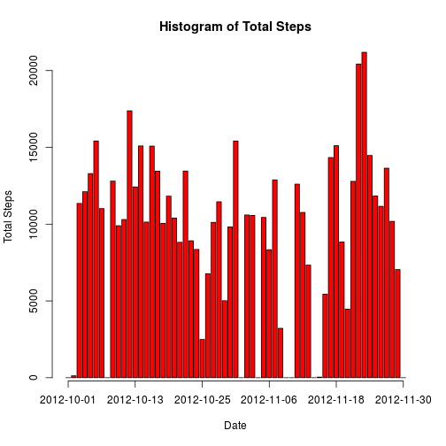
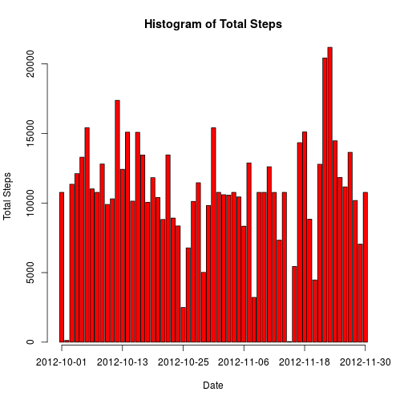
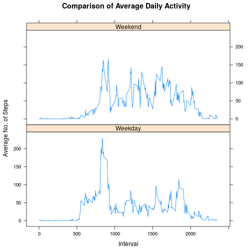

## Loading and preprocessing the data

First, load and preprocess the data:


```r
data <- read.csv(file="activity.csv",header=TRUE)
data$date <- as.Date(data$date,format="%Y-%m-%d")
```

## What is mean total number of steps taken per day?

Calculate and make a histogram of the total number of steps taken per day:


```r
stepstotal <- tapply(data$steps,data$date,sum,na.rm=TRUE)
modData <- as.data.frame(names(stepstotal))
names(modData) <- "Date"
modData$Steps <- sapply(modData$Date,function(x) stepstotal[[x]])

# Generate the histogram
mp <- barplot(modData$Steps,main="Histogram of Total Steps",xlab="Date",ylab="Total Steps",col="red")

# Add the x-axis ticks and labels
atx <- c(1,13,25,37,49,61) # The intervals to plot on x-axis
atact <- mp[atx,1] # The corresponding midpoints of the bars
labelsx <- sapply(atx,function(x) modData$Date[x]) # The corresponding labels
axis(1,at=atact,labels=labelsx,tick=TRUE) # Add the x-axis
```

 

Calculate and report the mean and median total number of steps taken per day:


```r
meanSteps <- mean(modData$Steps)
meanSteps
```

```
## [1] 9354.23
```

```r
medianSteps <- median(modData$Steps)
medianSteps
```

```
## [1] 10395
```

## What is the average daily activity pattern?

Determine the average daily activity pattern:


```r
stepsavg <- tapply(data$steps,data$interval,mean,na.rm=TRUE)
modData1 <- as.data.frame(as.numeric(names(stepsavg)))
names(modData1) <- "Interval"
modData1$AvgSteps <- sapply(modData1$Interval,function(x) as.numeric(stepsavg[[as.character(x)]]))

# Generate the time-series plot
plot(modData1$Interval,modData1$AvgSteps,main="Average Daily Activity",xlab="Interval",ylab="Average No. of Steps",type="l")
```

 

Calculate and report the interval, which, on average across all days, contains the maximum number of steps:


```r
maxSteps <- max(modData1$AvgSteps)
maxStepsInterval <- subset(modData1,modData1$AvgSteps==maxSteps)$Interval
maxStepsInterval
```

```
## [1] 835
```

## Imputing missing values

Calculate and report the total number of missing values in the dataset:


```r
good <- !is.na(data$steps)
notMissing <- data[good,]
totalMissing <- nrow(data) - nrow(notMissing)
```

Fill the missing values in the dataset with the mean for that 5-minute interval; and
Create a new dataset that is equal to the original dataset but with the missing data filled in:


```r
fillMissing <- data.frame(steps=as.numeric(data$steps),date=data$date,interval=as.numeric(data$interval))
numberRows <- nrow(fillMissing)
for (i in 1:numberRows) {
    if (is.na(fillMissing[i,1])) {
	fillMissing[i,1] <- subset(modData1,modData1$Interval==fillMissing[i,3])$AvgSteps
    }
}
```

Make a histogram of the total number of steps taken each day:


```r
stepstotal1 <- tapply(fillMissing$steps,fillMissing$date,sum)
modData2 <- as.data.frame(names(stepstotal1))
names(modData2) <- "Date"
modData2$Steps <- sapply(modData2$Date,function(x) stepstotal1[[x]])

# Generate the histogram
mp1 <- barplot(modData2$Steps,main="Histogram of Total Steps",xlab="Date",ylab="Total Steps",col="red")

# Add the x-axis ticks and labels
atx1 <- c(1,13,25,37,49,61) # The intervals to plot on x-axis
atact1 <- mp1[atx1,1] # The corresponding midpoints of the bars
labelsx1 <- sapply(atx1,function(x) modData2$Date[x]) # The corresponding labels
axis(1,at=atact1,labels=labelsx1,tick=TRUE) # Add the x-axis
```

 

Calculate and report the mean and median total number of steps taken per day:


```r
meanSteps2 <- mean(modData2$Steps)
meanSteps2
```

```
## [1] 10766.19
```

```r
medianSteps2 <- median(modData2$Steps)
medianSteps2
```

```
## [1] 10766.19
```
Both the mean and the median total number of steps taken per day rose in this case as compared to the initial case with missing values.

Moreover, upon replacing the missing values with the mean for corresponding 5-minute intervals, the mean and the median are both of the same value.

## Are there differences in activity patterns between weekdays and weekends?

Create a new factor variable in the dataset with two levels – "weekday" and "weekend" indicating whether a given date is a weekday or weekend day:


```r
fillMissing$wknd <- as.factor(ifelse(weekdays(fillMissing$date) %in% c("Saturday","Sunday"),"Weekend","Weekday"))
subData <- split(fillMissing,fillMissing$wknd)
wkdy <- subData[["Weekday"]]
wknd <- subData[["Weekend"]]
```

Make the desired panel plot containing a time series plot of the 5-minute interval (x-axis) and the average number of steps taken, averaged across all weekday days or weekend days (y-axis):


```r
stepsavg1 <- tapply(wkdy$steps,wkdy$interval,mean)
temp1 <- as.data.frame(as.numeric(names(stepsavg1)))
names(temp1) <- "Interval"
temp1$AvgSteps <- sapply(temp1$Interval,function(x) as.numeric(stepsavg1[[as.character(x)]]))
temp1$wknd <- rep("Weekday",nrow(temp1))

stepsavg2 <- tapply(wknd$steps,wknd$interval,mean)
temp2 <- as.data.frame(as.numeric(names(stepsavg2)))
names(temp2) <- "Interval"
temp2$AvgSteps <- sapply(temp2$Interval,function(x) as.numeric(stepsavg2[[as.character(x)]]))
temp2$wknd <- rep("Weekend",nrow(temp2))

temp <- rbind(temp1,temp2)

# Generate the time-series plot
library(lattice)
xyplot(AvgSteps ~ Interval | wknd, data = temp,layout=c(1,2),main="Comparison of Average Daily Activity",xlab="Interval",ylab="Average No. of Steps",type="l")
```

 
